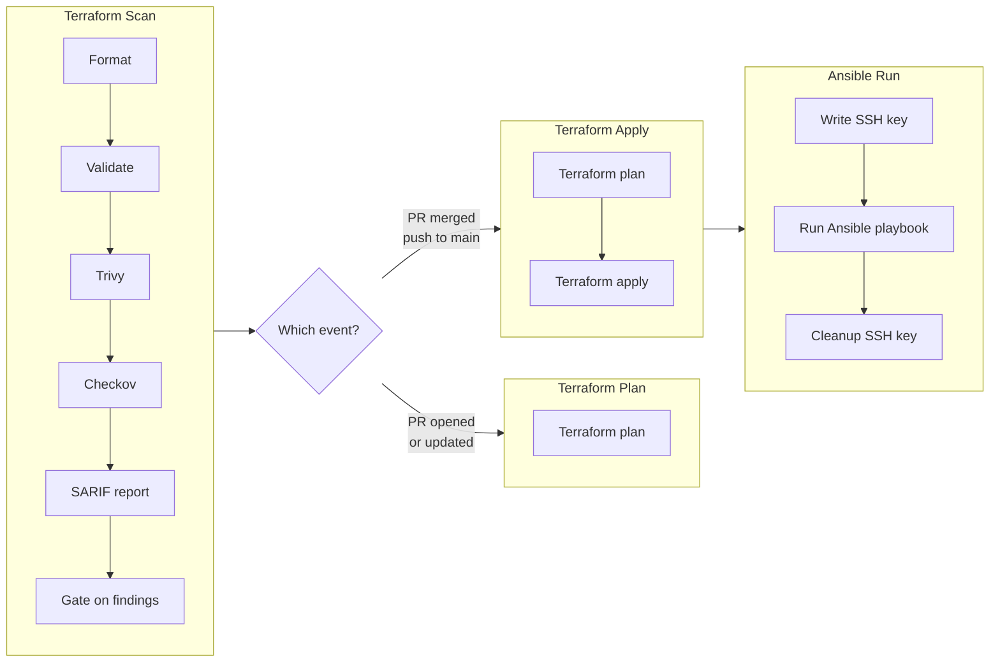

# IaC Pipeline

## Workflows

| Workflow | Runner | Purpose |
|---|---|---|
| `infra-pipeline.yml` | `[self-hosted, homelab]` | The pipeline itself: scan → plan/apply → ansible |
| `workflow-lin.yml` | `ubuntu-latest` | Lints and security-audits the workflow files (actionlint + zizmor) |
| `detection-validation.yml` | `ubuntu-latest` | Proves the scan gate still detects known-bad input |
| `scorecard.yml` | `ubuntu-latest` | OpenSSF Scorecard supply-chain scoring + badge |

## Infrastructure pipeline ([infra-pipeline.yml](./workflows/infra-pipeline.yml))

This is the main workflow handling the infrastructure using Terraform and Ansible alongside with SAST tools such as Trivy and Checkov.

|Event|Path|Jobs|
|---|---|---|
|Pull request|any|`terraform-scan` → `terraform-plan`|
|Push to main|`proxmox/terraform/**`, `proxmox/ansible/**`, `.github/workflows/**`| `terraform-scan` → `terraform-apply` → `ansible-run`

### Diagram

### Chekov
...
### Trivy
...
### Additional Security

**Least-privilege token:** Workflow-level `permissions: contents: read` sets a read-only default for every job's `GITHUB_TOKEN`. Jobs that need more (e.g. `terraform-scan` uploading SARIF) explicitly elevate in their own `permissions` block. Job-level permissions **replace** the default wholesale (they do not merge), so every elevated job re-declares all its needs. This prevents runaway privilege escalation.

**Concurrency serialization:** The Terraform backend is a local file with no state locking. `concurrency: {group: ${{ github.workflow }}, cancel-in-progress: false}` ensures only one run touches state at a time. `cancel-in-progress: false` queues new runs behind the running one rather than killing mid-apply, which would corrupt state or leave orphaned VMs.

**Dependabot isolation:** `terraform-plan` excludes Dependabot PRs. Dependabot's job is bumping action SHAs, so an automated PR is the exact vehicle by which a malicious upstream action release would execute inside the self-hosted runner before any human reviews the diff ([read more](https://www.sysdig.com/blog/how-threat-actors-are-using-self-hosted-github-actions-runners-as-backdoors)). Fork-PR approval doesn't cover Dependabot: its branches live in this repo, so they are not fork PRs.

**Persistent runner cleanup:** The self-hosted runner's workspace outlives individual jobs. All checkouts use `persist-credentials: false` to avoid leaving the `GITHUB_TOKEN` in `.git/config`. SSH keys for Ansible are written to `/tmp/homelab_ansible` and cleaned up with `if: always()` so they don't survive job failure.

**SARIF category requirement:** Each scanner (Trivy, Checkov, tflint) uploads SARIF with a distinct `category:` tag. Without it, the second upload overwrites the first tool's results for a given commit, hiding findings from earlier scanners.

**SSH key material handling:** The Ansible private key is passed via `env:` not inline `${{ }}` in the script, preventing interpolation into shell command text (which would log it). The base64-encoded secret is decoded only at runtime, and the file is immediately `chmod 600` restricted.

## Workflow lint (workflow.yml)
...