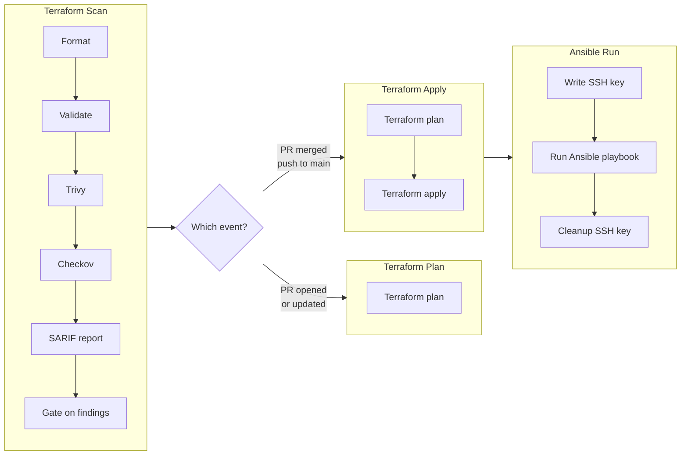

# IaC Pipeline

## Workflows

| Workflow | Runner | Purpose |
|---|---|---|
| `trigger.yml` | `[self-hosted, homelab]` | The pipeline itself: scan → plan/apply → ansible |
| `workflow.yml` | `ubuntu-latest` | Lints and security-audits the workflow files (actionlint + zizmor) |
| `detection-validation.yml` | `ubuntu-latest` | Proves the scan gate still detects known-bad input |
| `scorecard.yml` | `ubuntu-latest` | OpenSSF Scorecard supply-chain scoring + badge |

## Triggers ([trigger.yml](.github/workflows/trigger.yml))

This is the main workflow handling the infrastructure using Terraform and Ansible alongside with SAST tools such as Trivy and Checkov.

|Event|Path|Jobs|
|---|---|---|
|Pull request|any|`terraform-scan` → `terraform-plan`|
|Push to main|`proxmox/terraform/**`, `proxmox/ansible/**`, `.github/workflows/**`| `terraform-scan` → `terraform-apply` → `ansible-run`

### Diagram

